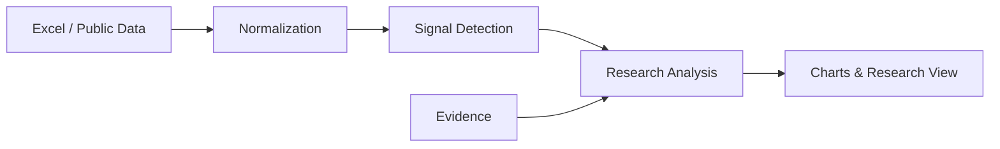

# MatRadar Lite

半导体封装材料产业研究雷达

A lightweight signal-and-evidence driven research tool for semiconductor packaging materials.

将原本分散在 Excel、金融终端与产业研究资料中的周度研究工作流产品化，通过数据标准化、规则识别与研究模板，自动生成图表和结构化研究解读。

**发布状态：本地公开版本已准备，GitHub 授权后上线。项目附件正在完成上线前排版，最终版将在真实链接验证后生成。**

## 1. 项目解决什么问题

周度研究常依赖人工更新分散表格、比较不同指标并组织结论，容易混淆数据事实、机制推断与尚待验证的证据。本项目将这一过程组织为 **Data → Signal → Analysis → Research View**，让每项结论回到可复核的数据变化与研究边界。

## 2. 产品演示

以下全部截图使用 SAMPLE 虚构数据，不反映实际行情或投资判断。

### 01 市场表现


### 02 产业数据


### 03 研究结论


## 3. 核心能力

- 将多类研究指标统一为日期、数值和单位明确的标准模板。
- 使用规则识别周度、月度变化、趋势及存储价格共振；本地研究版使用 Python，公开版使用 JavaScript。
- 通过市场、产业数据和研究结论三卡呈现完整研究流程。
- 上传 Excel，选择分析日期，即可重新生成图表与中文解读。
- **Local-first Excel Analysis**：文件在当前浏览器内存解析，刷新即清除，无需 API Key。

## 4. Research Workflow



## 5. 为什么不只是图表展示

变化率由程序计算，中文解读由规则和研究模板生成。研究依据可展开复核，缺少观察或基期时不补造数值。

| 层次 | 示例及边界 |
| --- | --- |
| Fact / 事实 | 样例 DXI 与 DRAM 的近4周变化均为正 |
| Inference / 推断 | 依照已公开阈值，样例存储价格呈同步改善 |
| Research View / 判断 | 可作为传统存储价格观察，不能直接推导材料企业盈利 |
| Missing Evidence / 待验证信息 | HBM 出货、产能配置、先进封装订单和材料认证 |

项目不生成股票推荐，也不以模板文本代替研究员审阅。公开示例未接入外部证据数据库，后续验证项均为研究提示。

## 6. 数据隐私

Public demo data are illustrative or derived for workflow demonstration. Proprietary source datasets are not distributed.

本仓库实际上仅分发确定性 **SAMPLE 虚构序列**，不含真实机构行情、商业数据库导出、券商内部研报或私有研究文件。指数名称用于展示字段含义，数值均非真实指数点位。

Excel 不上传服务器，不经 API 发送，不写入长期浏览器存储。刷新后上传文件和计算结果从当前页面清除，默认恢复 SAMPLE。图表库和解析库随站点提供。机构数据可在私有环境通过 Provider 接入，相关连接器与映射不在此分发。

详见 [数据与安全说明](SECURITY_AND_DATA.md)。

## 7. Tech Stack

| 版本 | 技术与作用 |
| --- | --- |
| 公开版（本仓库） | JavaScript、HTML/CSS、Plotly、SheetJS；静态展示与浏览器本地计算 |
| 私有研究开发版（未分发） | Python、Pandas、SQLite、Streamlit；研究数据处理及本地工作流 |

无需后端、商业数据库连接或大模型 API。第三方依赖许可证保留在 `docs/assets/`。

## 8. Architecture

Research Data → Normalization Layer → Signal Engine → Research Analysis → Static Research Dashboard

```text
docs/             可直接部署的完整静态站点
  assets/         页面样式、交互、解析计算与第三方库
  data/           小型 SAMPLE 演示快照
  screenshots/    三卡产品截图
src/              可独立复用的公开计算模块与说明
portfolio/        三页项目附件及排版源文件
```

计算模块详见 [src/README.md](src/README.md)。公开解析器仅接受标准模板，不附带私有周报列映射。

## 9. Try it

1. 打开 Live Demo（上线前可直接打开 `docs/index.html`）。
2. 展开“数据”，切换“上传 Excel”，下载标准模板。
3. 保留四张表及表头；替换 SAMPLE 数值后同步更新 Meta 标识和数据集名称。
4. 上传模板，选择分析日期，点击“生成分析”。
5. 在三卡间查看结果，展开研究依据核对口径；刷新会清除上传内容。

模板包含 Market、Memory、Trade、Meta。市场采用点位，DRAM/NAND 采用美元，贸易金额采用万美元。百分比显示单元格不会当作原始价格处理；缺失基期不推算收益。

GitHub Pages 发布源为 **main / docs**，所有运行资源采用相对路径。

## 10. Disclaimer

仅用于研究工作流与软件能力展示，不构成投资建议。SAMPLE 数据不得用于真实决策。MIT 许可覆盖本仓库自有代码；第三方库适用各自许可证，商业数据与第三方研究材料不在授权范围内。
