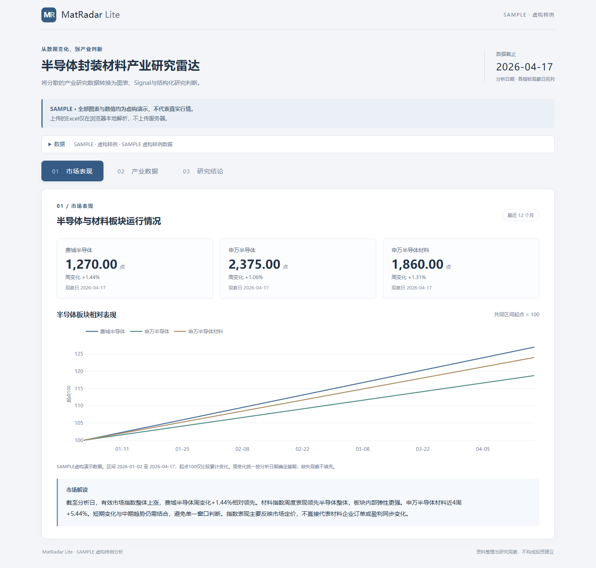
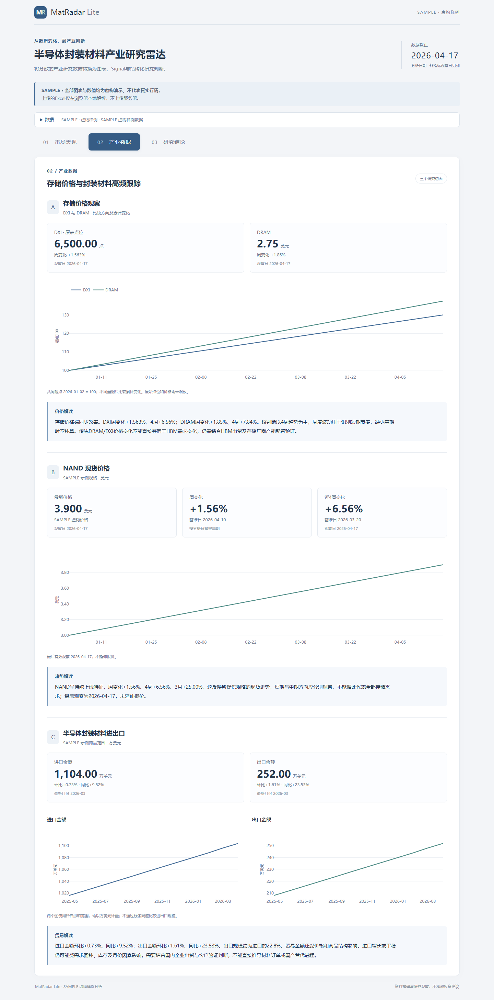
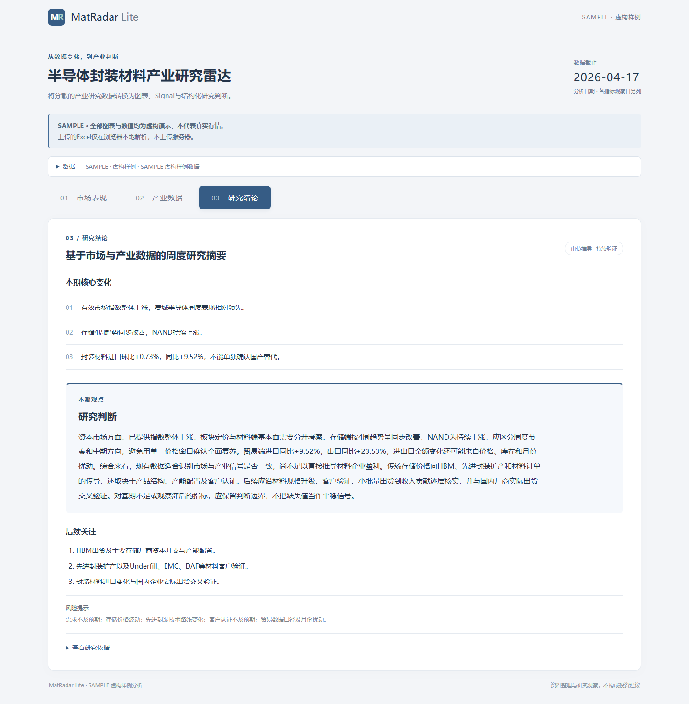

# MatRadar Lite

半导体封装材料产业研究雷达

A lightweight research workflow for semiconductor packaging materials.

将原本分散在 Excel、金融终端与产业资料中的半导体材料周度研究流程标准化，对市场表现、存储价格、贸易与产业高频数据进行统一处理，通过规则识别边际变化、趋势共振与分化，并结合产业链传导逻辑形成结构化研究判断。

MatRadar Lite 并不试图用单一指标替代研究员判断，而是将研究过程拆分为 Data → Signal → Cross-validation → Mechanism → Research View：先识别“发生了什么”，再回答“为什么发生、能否持续、通过什么路径传导，以及还缺少哪些验证”。

[Live Demo](https://lengmonanren.github.io/MatRadar-Lite/) · [GitHub Repository](https://github.com/Lengmonanren/MatRadar-Lite) · [Project Portfolio PDF](portfolio/MatRadar_Lite_Project_Portfolio.pdf)

## 1. 项目解决什么问题

从“更新数据”到“形成判断”
传统周度产业研究的难点并不只是 Excel 更新耗时，更在于不同频率、不同口径的数据如何共同形成一套可解释的研究结论。
市场指数、产品价格、进出口、库存、开工率及公司事件往往同时变化，但单一指标通常不足以直接证明产业景气或企业盈利。例如，价格上涨既可能来自需求扩张，也可能由供给收缩、成本推动或短期交易行为造成；进口下降既可能对应国产供给增加，也可能来自需求走弱或库存变化。
因此，MatRadar 将研究流程拆解为：

Data → Signal → Validation → Mechanism → Research View

Data｜数据事实：市场、价格、贸易等可观测指标；
Signal｜边际信号：识别周度/月度变化、趋势、共振与分化；
Validation｜交叉验证：比较不同指标是否支持同一方向，避免依赖单一数据；
Mechanism｜产业机制：判断变化来自需求、供给、技术升级还是产业结构变化；
Research View｜研究判断：明确当前证据能够支持什么，以及哪些结论仍需进一步验证。

这种结构与产业研究中常见的“先观察数据变化，再拆解供需原因和持续性”的过程一致。此前周报对硅片价格变化，也是先确认价格上涨，再进一步拆解海外采购、季节性需求和短期供给偏紧等原因，而不是停留在价格本身。

## 2. 产品演示

以下全部截图使用 SAMPLE 虚构数据，不反映实际行情或投资判断。

### 01 市场表现


### 02 产业数据


### 03 研究结论


## 3. 核心能力
① 多源研究数据标准化

将市场指数、存储价格、半导体材料贸易等不同频率数据统一为明确的 日期、指标、数值、单位与数据口径，处理日期错位、缺失观察及不同量纲问题，为后续比较建立统一基础。

② Signal Engine：识别真正值得研究的边际变化。

自动计算 WoW / 4W / 3M / MoM / YoY 等变化，并识别：

趋势强化 / 趋势弱化
多指标共振 / 指标分化
阶段性异常变化
市场表现与产业数据背离

③ Research Framework：从数据变化到产业判断

MatRadar 根据研究对象区分两套分析逻辑。

周期型材料：

成本 → 供给 → 需求 → 库存 → 价格/价差 → 开工率 → 盈利

价格变化需要结合库存、开工和供需状态进行判断。化工行业研究中，价格、价差、库存和开工率往往需要联合观察，单一涨价并不足以判断盈利周期反转。

高端新材料：

终端需求 → 技术升级 → 材料规格/单耗变化 → 供应格局 → 国产替代 → 客户认证 → 批量出货 → 收入与盈利

对于半导体材料，需求增长只是起点。真正决定公司能否兑现的变量，还包括产品纯度与批次稳定性、供应格局、客户验证进度及量产能力。此前半导体材料研究也将需求扩张、海外供应集中和国内客户验证作为不同层次分别分析。

④ Research Discipline：给判断设置边界

系统显式区分：

FACT → INFERENCE → RESEARCH VIEW → MISSING EVIDENCE

核心约束包括：

价格上涨 ≠ 景气反转
存储价格改善 ≠ HBM需求同步改善
进口下降 ≠ 国产替代已经实现
拥有相关产品 ≠ 客户已经认证
通过验证 ≠ 已形成批量收入
产业趋势受益 ≠ 公司盈利立即兑现

当信息链条不完整时，系统保留 Needs Validation，而不是填补不存在的证据。

⑤ Local-first Excel Analysis

用户可以直接上传标准 Excel、选择分析日期，由浏览器本地完成：

数据解析 → 日期回溯 → 指标计算 → 图表更新 → 中文研究解读

上传文件仅存在于当前浏览器内存，不上传服务器；刷新页面后数据清除。公开版本无需 Wind、商业数据库或 API Key 即可运行，同时保留未来接入机构数据源的扩展空间。

## 4. Research Workflow


## 5. 为什么不只是图表展示

变化率由程序计算，中文解读由规则和研究模板生成。研究依据可展开复核，缺少观察或基期时不补造数值。

| 研究层级                       | 系统回答的问题           | 示例                              |
| -------------------------- | ----------------- | ------------------------------- |
| **Fact｜数据事实**              | 实际发生了什么？          | DXI、DRAM 近4周均上涨                 |
| **Signal｜边际变化**            | 这一变化是否具有异常性或一致性？  | 两项指标方向一致并超过规则阈值，形成价格共振          |
| **Cross-validation｜交叉验证**  | 其他指标是否支持相同判断？     | 继续观察 NAND、存储厂商资本开支及出货变化         |
| **Mechanism｜产业机制**         | 为什么变化？通过什么路径影响材料？ | 存储需求改善 → 先进封装需求变化 → 材料规格与用量变化   |
| **Realization｜兑现条件**       | 产业变化如何转化为公司收入？    | 客户送样 → 验证 → 认证 → 小批量 → 批量供应     |
| **Research View｜研究判断**     | 当前能够形成什么结论？       | 可确认传统存储价格改善，但尚不能直接判断 HBM 材料订单增长 |
| **Missing Evidence｜待验证信息** | 还缺什么证据？           | HBM出货、存储厂Capex、先进封装订单、客户认证与实际出货 |

研究的核心不是寻找“利好”，而是判断变化是否能够沿产业链持续传导。
对半导体新材料而言，真正的研究链条通常需要经过 终端需求 → 技术升级 → 材料规格/价值量 → 全球供应格局 → 国产替代 → 客户验证 → 批量出货 → 盈利贡献。只有当前一环节得到事实支持时，才继续向下一层推导。

MatRadar 的目标不生成股票推荐、也不是替研究员自动下结论，而是把“数据—机制—证据—判断边界”组织成一套可复核的研究流程。公开示例未接入外部证据数据库，后续验证项均为研究提示。

## 6. 数据隐私

Public demo data are illustrative or derived for workflow demonstration. Proprietary source datasets are not distributed.

本仓库实际上仅分发确定性 **SAMPLE 虚构序列**，不含真实机构行情、商业数据库导出、券商内部研报或私有研究文件。指数名称用于展示字段含义，数值均非真实指数点位。

Excel 不上传服务器，不经 API 发送，不写入长期浏览器存储。刷新后上传文件和计算结果从当前页面清除，默认恢复 SAMPLE。图表库和解析库随站点提供。机构数据可在私有环境通过 Provider 接入，相关连接器与映射不在此分发。

详见 [数据与安全说明](SECURITY_AND_DATA.md)。

## 7. Tech Stack

| 版本 | 技术与作用 |
| --- | --- |
| 公开版（本仓库） | JavaScript、HTML/CSS、Plotly、SheetJS；静态展示与浏览器本地计算 |
| 私有研究开发版（未分发） | Python、Pandas、SQLite、Streamlit；研究数据处理及本地工作流 |

无需后端、商业数据库连接或大模型 API。第三方依赖许可证保留在 `docs/assets/`。

## 8. Architecture

Research Data → Normalization Layer → Signal Engine → Research Analysis → Static Research Dashboard

```text
docs/             可直接部署的完整静态站点
  assets/         页面样式、交互、解析计算与第三方库
  data/           小型 SAMPLE 演示快照
  screenshots/    三卡产品截图
src/              可独立复用的公开计算模块与说明
portfolio/        三页项目附件及排版源文件
```

计算模块详见 [src/README.md](src/README.md)。公开解析器仅接受标准模板，不附带私有周报列映射。

## 9. Try it

1. 打开 Live Demo（上线前可直接打开 `docs/index.html`）。
2. 展开“数据”，切换“上传 Excel”，下载标准模板。
3. 保留四张表及表头；替换 SAMPLE 数值后同步更新 Meta 标识和数据集名称。
4. 上传模板，选择分析日期，点击“生成分析”。
5. 在三卡间查看结果，展开研究依据核对口径；刷新会清除上传内容。

模板包含 Market、Memory、Trade、Meta。市场采用点位，DRAM/NAND 采用美元，贸易金额采用万美元。百分比显示单元格不会当作原始价格处理；缺失基期不推算收益。

GitHub Pages 发布源为 **main / docs**，所有运行资源采用相对路径。

## 10. Disclaimer

仅用于研究工作流与软件能力展示，不构成投资建议。SAMPLE 数据不得用于真实决策。MIT 许可覆盖本仓库自有代码；第三方库适用各自许可证，商业数据与第三方研究材料不在授权范围内。
